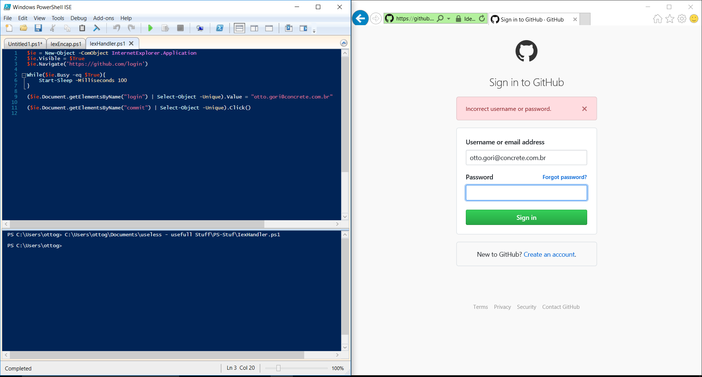

~~~powershell
    Write-Verbose 'Essa é uma linha que só aparecerá se eu chamar uma função com o switch "-verbose" '
~~~

Digamos que eu seja um Dev da página do github e recebi uma demanda para atualizar o método de login, de forma que: se alguém digitar o usuário e não digitar a senha, essa pessoa receba um alerta e o login não seja efetuado. Preciso também de uma evidência do teste, nesse caso vamos dar um print da tela. Para testar minha nova funcionalidade de login, farei diversos deployments em meu ambiente de LAB e decidi automatizar o teste de login para que em todos os meus deployments eu receba uma evidência de comportamento.

A primeira coisa que terei de fazer é criar um COM-Object do Internet Explorer. O controle de dotNET COM Objects é bem simples, fica assim:

~~~powershell
    $ie = New-Object -ComObject InternetExplorer.Application
    $ie.Visible = $True
~~~

Aqui então a variável `$ie` (no Posh, variáveis são iniciadas por "$"{algo que a MS gosta}) recebe um objeto `InternetExplorer.Application`, todas as propriedades deste objeto são acessíveis via dotSourcing.

A segunda ação é navegar até a página do github e aguardar que o COM esteja livre para uso.

~~~powershell
    $ie.Navigate('https://github.com/login')

    While($ie.Busy -eq $True){
        Start-Sleep -Milliseconds 100
    }
~~~

>Caso tenha curiosidade, é possível utilizar dotSourcing para receber o conteúdo da página, eg:
~~~powershell
    $ie.Document.Body.InnerText
~~~

Com a página carregada, preciso identificar os objetos da tela e popular seus valores, para tal, uso o mesmo trabalho acima com o recurso de dotSourcing.

~~~powershell
    $ie.Document.getElementsByName("login")
~~~ 

Porém, a linha acima me traz o objeto e o que eu quero é selecionar e popular com um texto, para isso uso outra função do Posh, a `Select-Object` com o switch `-Unique` que faz desta uma seleção unária.

~~~powershell
    $ie.Document.getElementsByName("login") | Select-Object -Unique
~~~

Defino então a propriedade `Value` deste objeto com o meu login do github.

~~~powershell
    ($ie.Document.getElementsByName("login") | Select-Object -Unique).Value = "otto.gori@concrete.com.br"
~~~

Observem a evolução da seleção quando executada na console:

~~~powershell
    C:\Users\ottog> $ie.Document.getElementsByName("login") | Select-Object -Unique | Format-Table

    className                id          tagName parentElement      style              onhelp onclick ondblclick onkeydown onkeyup
    ---------                --          ------- -------------      -----              ------ ------- ---------- --------- -------
    form-control input-block login_field INPUT   System.__ComObject System.__ComObject
~~~

Cada uma destas propriedades é um objeto que pode ser expandido e trabalhado, digamos que eu queira saber o tipo deste objeto. Para isso basta selecionar a propriedade `type`.

~~~powershell
    C:\Users\ottog> $ie.Document.getElementsByName("login") | Select-Object type | Format-Table

    type
    ----
    text
~~~

E assim segue...

Seguindo nossa POC: NÃO vamos digitar a senha e em seguida vamos dar um hit no botão login. (que curiosamente na página do github se chama "commit"). Para isso, usamos algo parecido com o case acima, porém invocando o método "click" do próprio COM-Obj:

~~~powershell
    ($ie.Document.getElementsByName("commit") | Select-Object -Unique).Click()
~~~

Se executarmos o código (tanto na ISE quanto na console), esse será o resultado:

Como evidência de meu teste, quero um print da tela de login com a mensagem. Existem formas mais simples de fazer isso, mas quero mostrar uma bem "baixo nivel" que é controlando propriedades do sistema e assemblies do dotNet. Fica assim:

~~~powershell
    #Esta linha carrega as propriedades de meu monitor principal
    $monitor =  [System.Windows.Forms.SystemInformation]::PrimaryMonitorSize
    
    #Esta linha usa a lib "Drawing" para estipular as dimensões do retângulo que será a minha imagem. Observem o cast feito na variável "$monitor" para obter a altura e largura do monitor
    $bounds = [Drawing.Rectangle]::FromLTRB(0, 0, $monitor.Width, $monitor.Height) 

    $bmp = New-Object Drawing.Bitmap $bounds.width, $bounds.height

    $graphics = [Drawing.Graphics]::FromImage($bmp)

    $graphics.CopyFromScreen($bounds.Location, [Drawing.Point]::Empty, $bounds.size)

    # "$HOME" estipula a home de meu usuário
    $bmp.Save("$HOME\print.png")

    $graphics.Dispose()
    $bmp.Dispose()
~~~

Terminado isso eu quero somente exibir automaticamente o print salvo. Para tal, basta invocar o caminho do arquivo.

~~~powershell
    Invoke-Item "$HOME\print.png"
~~~

Nosso código completo fica assim:

~~~powershell
    $ie = New-Object -ComObject InternetExplorer.Application
    $ie.Visible = $True

    $ie.Navigate('https://github.com/login')

    While($ie.Busy -eq $True){
        Start-Sleep -Milliseconds 100
    }

    ($ie.Document.getElementsByName("login") | Select-Object -Unique).Value = "otto.gori@concrete.com.br"

    ($ie.Document.getElementsByName("commit") | Select-Object -Unique).Click()

    While($ie.Busy -eq $True){
        Start-Sleep -Milliseconds 100
    }

    $monitor =  [System.Windows.Forms.SystemInformation]::PrimaryMonitorSize

    $bounds = [Drawing.Rectangle]::FromLTRB(0, 0, $monitor.Width, $monitor.Height)

    $bmp = New-Object Drawing.Bitmap $bounds.width, $bounds.height

    $graphics = [Drawing.Graphics]::FromImage($bmp)

    $graphics.CopyFromScreen($bounds.Location, [Drawing.Point]::Empty, $bounds.size)

    $bmp.Save("$HOME\print.png")

    $graphics.Dispose()
    $bmp.Dispose()

    Invoke-Item "$HOME\print.png"

    $ie.Quit()
~~~

No próximo módulo vamos fazer com que esse código não seja tão "straightforward". Está vendo essas duas chamadas iguais do `sleep`? Vamos transformar ela numa função. Vê o hard coding? Vamos remover. Vê como poderíamos criar um handler para os elementos da página web? Vê como poderia transformar esse print numa função também? (...)? 
Tudo isso será abordado aqui: [MODULO 2 - FUNÇÕES](../function/fnc.md)